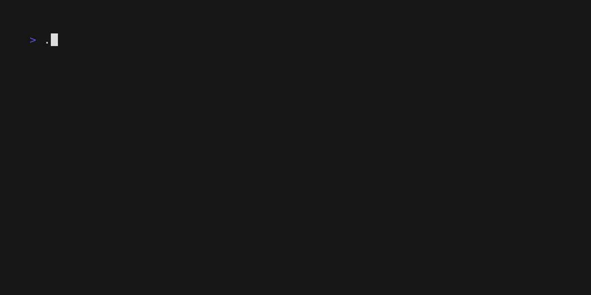

# boa

An cli argument parser, using [spf13/cobra](https://github.com/spf13/cobra), for shell scripts.


### Example



Similar to [charmbracelet/gum](https://github.com/charmbracelet/gum), this binary file takes the use of go parsing and validation of cli arguments and makes it available for shell scripts.

As seen in the [example](docs/example.gif), the cli can be defined in a bash script like so:

```sh
cli="""
use: boash
short: a boa example
long: |
  This is an cli example from sh
  of how to use boa in a shell script
flags:
  - use: carbon
    short: It has symbol C and atomic number 6.
    alias: c
    type: string
  - use: nitrogen
    short: It has symbol N and atomic number 7.
    alias: n
    type: int
  - use: oxygen
    short: It has symbol O and atomic number 8.
    alias: o
"""

# parse the cli arguments
result=$(echo "$cli" | boa $@)
```

The `boa` binary will parse the cli arguments and return a string with the values of the flags.


### Installation

With **go** installed, run the following command:

```sh
go install github.com/marcelofpfelix/boa@latest
```

It's a statically linked Go binary, so you can also **download** it directly:

```sh
curl -sL https://github.com/marcelofpfelix/boa/releases/latest/download/boa_Linux_x86_64.tar.gz | tar xvz

sudo mv boa /usr/local/bin
```
